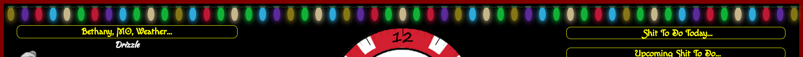
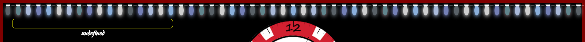

# MMM-HolidayLights
Holiday Lights for MM. Base Module: MMM-Xmas by cowboysdude

# Installation
  
Clone to you MM2 modules directory, No install needed

	git clone https://github.com/justjim/MMM-HolidayLights.git
     
# Config Entry

	{
		module: "MMM-HolidayLights",
		position: "fullscreen_above",
		config: {
			css: "", //See ReadMe for choices available
		}
	},

## Options

Insert the name of the css file you want to use. Just the Name, not the extension.
See the CSS folder for names available
There is also a HolidayTemplate.css file, Make your own color scheme!

## Examples

** Holidays**

Nears Years

Valentines Day

Easter

4th Of July

Halloween

Thanksgiving

Christmas

**Events & Celebrations**

Mardi Gras

Pride Festival

**Seasons**

Spring

Summer

Autumn

Winter

**NFL Team Colored Themes**

Chiefs

Cowboys

Broncos

Patriots

Packers

Titans

Dolphins

     
**Hope y'all like it!!!**
